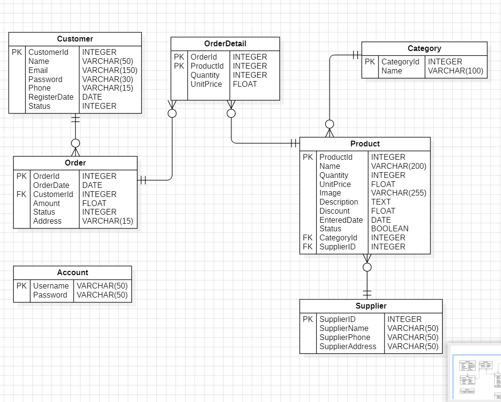
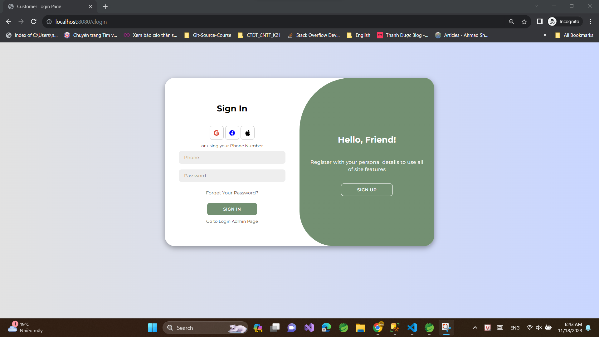
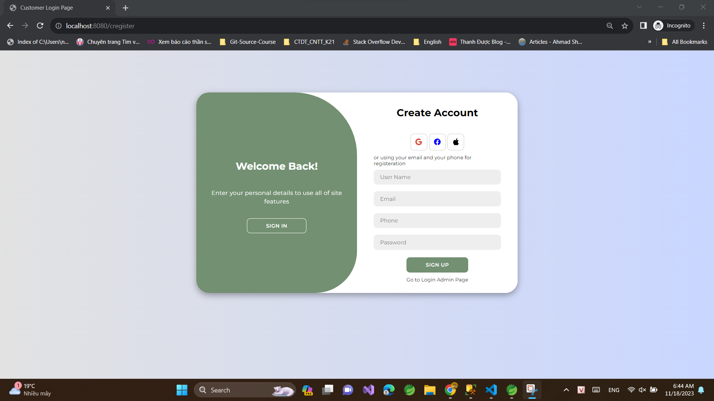
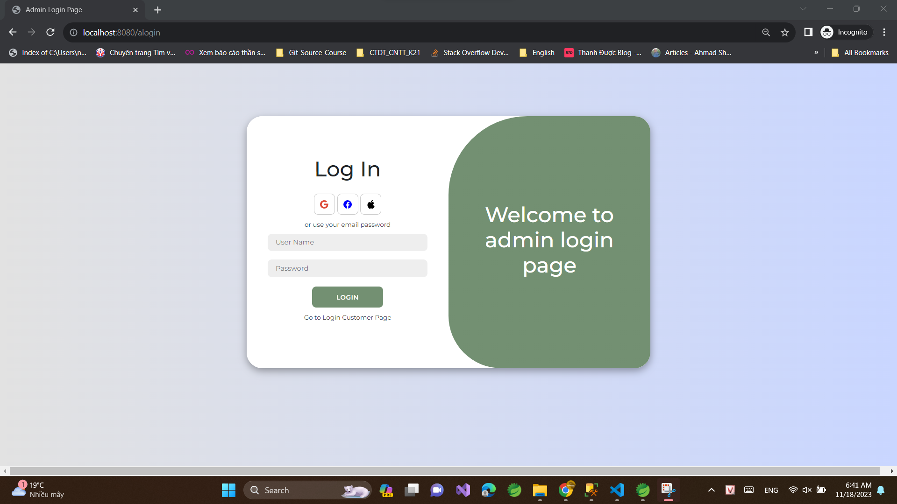
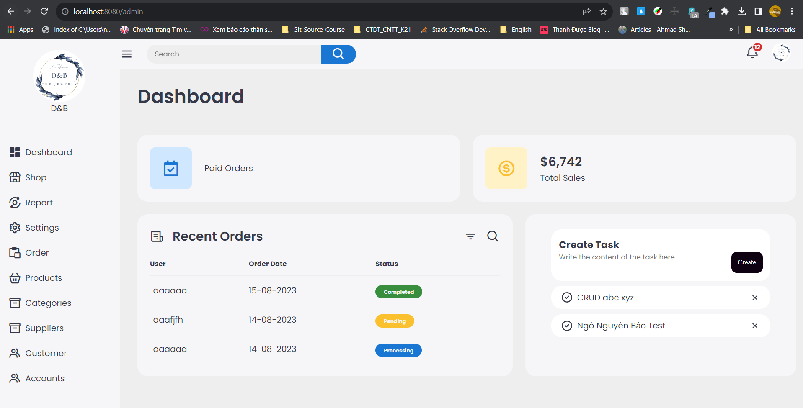

# D-B-Shop

Website Thương mại điện tử với các chức năng đăng nhập, đăng kí, giỏ hàng, mua hàng, trang quản lý. 

E-commerce website with functionalities including login, registration, shopping cart, purchase, and management page.

---

# ERD Model

---

# Teachonology

| Name                 | Description                  |
| -------------------- | ---------------------------- |
| Fontend              | Html, Css, Js                |
| Backend              | Spring Framework             |
| Datasbase            | SQL Sever (mssql-jdbc)       |
| Java Persistence API | spring-boot-starter-data-jpa |
| Security             | org.springframework.security |
| UpLoad File          | commons-io                   |
| View Engine          | thymeleaf                    |
| ...                  | ...                          |

## Admin Account:

- username: admin001
- password: 123456

---

<h1><em>Screenshots D&B Shop</em><h1>

### Customer

Customer Login:

Customer Register:

### Admin

Admin: Login

Admin: Dashboard

